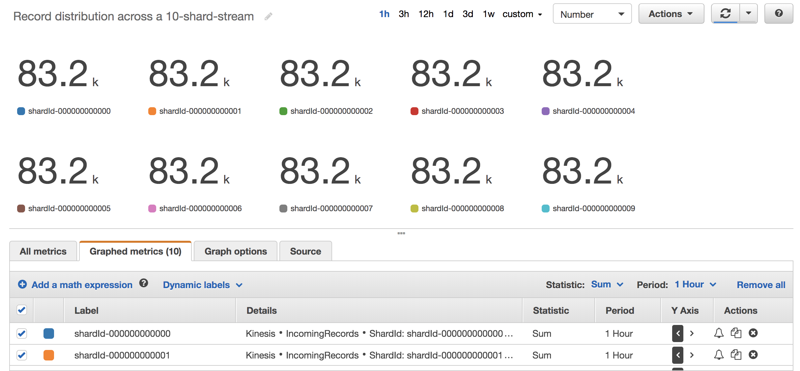

# Implementing fast and light-weight Kinesis Data Producers using low-level APIs

Sample source code to develop fast and light-weight Kinesis Data Producers using low-level APIs.

## List of Java classes and their purpose

| Class   | Overview |
|-------- | -------- |
| [KinesisStreamUtil](./src/main/java/com/amazonaws/kinesis/blog/demo/KinesisStreamUtil.java) | Utility class to fetch list of Hash Keys from Kinesis Shards. |
| [KinesisProducerDemo](./src/main/java/com/amazonaws/kinesis/blog/demo/KinesisProducerDemo.java) | Class with methods to write messages to Kinesis Steam using PutRecord and PutRecords APIs using explicit Hash Keys.|
| [HashKeysBootstrapper](./src/main/java/com/amazonaws/kinesis/blog/lambda/demo/HashKeysBootstrapper.java) | Utility class to fetch Shard details for a given stream and populate DynamoDB table. |
| [KinesisShard](./src/main/java/com/amazonaws/kinesis/blog/lambda/demo/KinesisShard.java) | A POJO class to hold Shard details. |
| [DynamoDBUtil](./src/main/java/com/amazonaws/kinesis/blog/lambda/demo/DynamoDBUtil.java) | Utility class for DynamoDB to write and read Hash keys to/from a table. |
| [LambdaFunctionHandler](./src/main/java/com/amazonaws/kinesis/blog/lambda/demo/LambdaFunctionHandler.java) | Lambda Function to load data from S3 to Kinesis. |

## Testing the code from IDE e.g. Eclipse

1. Create a Kinesis Steam with multiple shards e.g. 10 shards
1. Open the class [KinesisProducerDemo](./src/main/java/com/amazonaws/kinesis/blog/demo/KinesisProducerDemo.java)
1. Edit **region** and **streamName** variables to the AWS region and the name of the Kinesis Steam
1. Run [KinesisProducerDemo](./src/main/java/com/amazonaws/kinesis/blog/demo/KinesisProducerDemo.java)

   **Note:** Make sure you have configured AWS Credentials on your IDE / Laptop. If not, refer to [Set up AWS Credentials](https://docs.aws.amazon.com/toolkit-for-eclipse/v1/user-guide/setup-credentials.html)

## Testing the code using AWS Lambda, Amazon S3, and Amazon Kinesis

### Pre-requisites

1. S3 bucket
2. Sample data. E.g.
[New York City Taxi and Limousine Commission (TLC) Trip Record Data](https://registry.opendata.aws/nyc-tlc-trip-records-pds/)
3. Execution role for Lambda with permissions for S3, CloudWatch, DynamoDB, and Kinesis. to create one, refer documentation [AWS Lambda Execution Role](https://docs.aws.amazon.com/lambda/latest/dg/lambda-intro-execution-role.html)
4. Create a Kinesis Stream with desired number of Shards
5. Create a DynamoDB table to store Shard details
6. Get Shards details and populate DynamoDB table by running [HashKeysBootstrapper](./src/main/java/com/amazonaws/kinesis/blog/lambda/samples/HashKeysBootstrapper.java)

### Lambda Deployment Instructions

1. The source code has Maven nature, so if you have Maven locally then you can build it using standard Maven commands e.g. ```mvn -X clean install```. or use the options available in your IDE
1. This will generate a Jar called ```amazon-kinesis-low-level-producer-sample-1.0```
1. Use this to deploy a Lambda function
1. During deployment, use the following values:
   - Handler name: ```com.amazonaws.kinesis.blog.lambda.demo.LambdaFunctionHandler```
   - Runtime: Java 8
1. For environment variables:
   - key = ```target_kinesis_stream```, value = name of the Kinesis Stream
   - key = ```tbl_kinesis_shard_hashkeys```, value = name of the DynamoDB table
1. Select S3 as a trigger and configure the S3 bucket and other settings

### Test the Lambda Function

1. Upload a file to S3 bucket
1. This will trigger the Lambda function

### Expected Output from Kinesis Stream

1. The records from input file will be processed in Lambda and written to Kinesis Stream across all of its shards.
1. To verify Kinesis metrics via Amazon CloudWatch, following the steps below:
   - Navigate to  CloudWatch -> Metrics -> Kinesis 
   - Select 'ShardId, StreamName'
   - Select all shards of the stream for metric 'IncomingRecords'
   - Select tab **Graphed Metrics**
   - For **Statistic**, select **Sum**
   - For **Period**, select as appropriate
   - An example metric shown in the below screenshot. 
   **This is only for reference and do not represent any meaningful facts.**
  
1. Optionally, to verify the data, you can consume records from Stream.

## Supplemental Sources: CloudFormation Templates

| Template        | Overview             |
|---------------- | ---------------------|
| [CF_Template_DynamoDBTables](./src/main/resources/CF_Template_DynamoDBTables.yaml) | CloudFormation template to create DynamoDB tables. |

## Supplemental Sources: Programs written in Python

| File                   | Overview        |
|----------------------- | ----------------|
| [get_hashkeys](./src/main/resources/get_hashkeys.py) | It has a method to fetch list of Hash Keys from Kinesis Shards |
| [kinesis_producer_demo](./src/main/resources/kinesis_producer_demo.py) | It has functions to write messages to Kinesis Steam using PutRecord and PutRecords APIs using explicit Hash Keys. |

## Customizing these samples to suit your use case

From Lambda use case point of view, using a DynamoDB table to store Kinesis Shard details is optional and better suited for certain use cases. For e.g. your Lambda function exceeds a concurrency of 100. Refer to AWS documentation [ListShards](https://docs.aws.amazon.com/kinesis/latest/APIReference/API_ListShards.html) for more details.
To customize this code, refer to [LambdaFunctionHandler](./src/main/java/com/amazonaws/kinesis/blog/lambda/samples/LambdaFunctionHandler.java) on how to customize this implementation.

## License Summary

This sample code is made available under the MIT license. See the LICENSE file.
